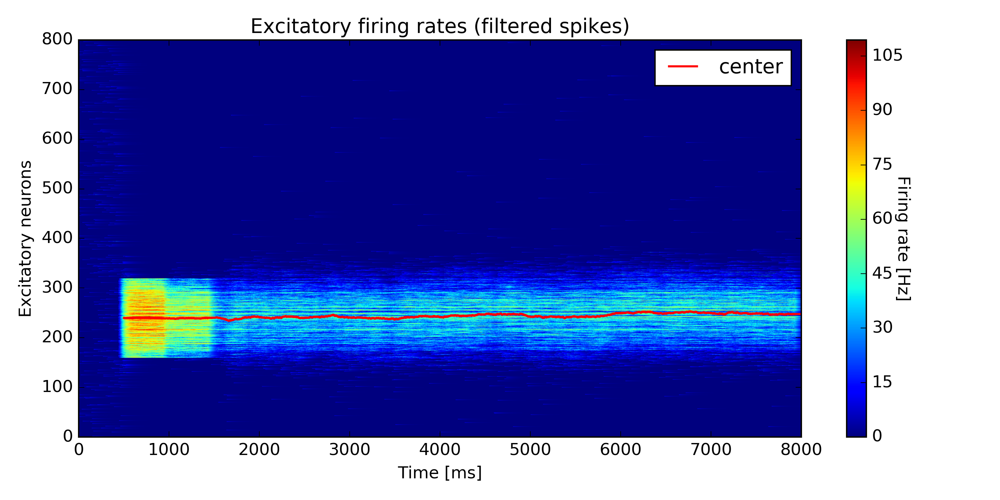
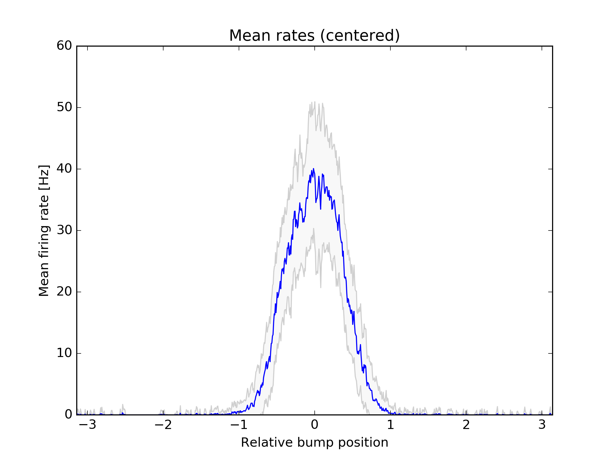
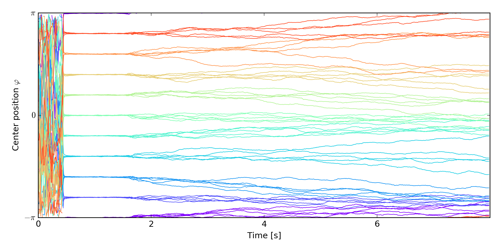

[](https://travis-ci.com/flinz/seeholzer-deger-2018)

# seeholzer-deger-2018

Spiking neuronal network simulations (Python, NEST Simulator) for continuous attractor working memory networks with short-term plasticity. This repository contains code accompanying the publication:

A. Seeholzer, M. Deger, and W. Gerstner, “[Stability of working memory in continuous attractor networks under the control of short-term plasticity][1],” bioRxiv, p. 424515, Sep. 2018.

## Contents

  * [Installation](#installation)
    + [Minimum dependencies](#minimum-dependencies)
    + [Build via docker image (the easy way)](#build-via-docker-image--the-easy-way-)
    + [Build locally (the harder way)](#build-locally--the-harder-way-)
  * [Networks](#networks)
    + [Available networks](#available-networks)
    + [Neuron parameters](#neuron-parameters)
  * [Running simulations](#running-simulations)
    + [SimBump: Single bump trajectory](#simbump--single-bump-trajectory)
      - [Plots](#plots)
        * [Excitatory firing rates (filtered spikes)](#excitatory-firing-rates--filtered-spikes-)
        * [Mean firing rates (rectified)](#mean-firing-rates--rectified-)
    + [SimDrift: Repeated bump trajectories (drift profiles)](#simdrift--repeated-bump-trajectories--drift-profiles-)
      - [Plots](#plots-1)
        * [Drift profile](#drift-profile)
  * [Data files](#data-files)
    + [Opening data files](#opening-data-files)

## Installation

### Minimum dependencies
* gcc-5 (tested) or higher
* libgsl
* cython 0.23.4 (tested) or higher
* python 2.7

### Build via docker image (the easy way)
```
git clone --recursive https://github.com/flinz/seeholzer-deger-2018.git
docker build -t seeholzer/2018 .
docker run -it --rm seeholzer/2018 /bin/bash
```

The code will be contained in the directory `/seeholzer-deger-2018` in the docker image. You can also mount a local directory into the docker container by specifying a flag `-v local:mounted` in the `docker run` command.

For example:
```
docker run -v /home/me/my_code:/my_code -it --rm seeholzer/2018 /bin/bash
```

### Build locally (the harder way)
Makes Nest & installs python dependencies. Final step sets environment variables that will add NEST to Python.
```
git clone --recursive https://github.com/flinz/seeholzer-deger-2018.git
make
source set_vars.sh
``` 

## Networks

### Available networks

All networks used in [the publication][1] are included as presets in this repository. To list the available networks, call

```python
import tools.db
tools.db.print_networks()
```  

which will output
<sub>
```
Using database 'sqlite':  Engine(sqlite:///db/database_published.sqlite3)
Set: tau650 stablewidth
id: 45 - U: 0.6, tau_f: 650, tau_x: 150,
id: 46 - U: 0.4, tau_f: 650, tau_x: 150,
id: 47 - U: 0.2, tau_f: 650, tau_x: 150,
id: 48 - U: 0.1, tau_f: 650, tau_x: 150,
id: 49 - U: 0.08, tau_f: 650, tau_x: 150,
id: 50 - U: 0.06, tau_f: 650, tau_x: 150,
id: 51 - U: 0.04, tau_f: 650, tau_x: 150,
id: 52 - U: 0.02, tau_f: 650, tau_x: 150,
id: 53 - U: 0.8, tau_f: 650, tau_x: 150,
id: 66 - U: 1, tau_f: 650, tau_x: 150,

Set: tau650 depressions
id: 54 - U: 0.1, tau_f: 650, tau_x: 140,
id: 55 - U: 0.1, tau_f: 650, tau_x: 120,
id: 56 - U: 0.1, tau_f: 650, tau_x: 180,
id: 57 - U: 0.1, tau_f: 650, tau_x: 200,
id: 58 - U: 0.4, tau_f: 650, tau_x: 140,
id: 59 - U: 0.4, tau_f: 650, tau_x: 120,
id: 60 - U: 0.4, tau_f: 650, tau_x: 180,
id: 61 - U: 0.4, tau_f: 650, tau_x: 200,
id: 62 - U: 0.8, tau_f: 650, tau_x: 200,
id: 63 - U: 0.8, tau_f: 650, tau_x: 180,
id: 64 - U: 0.8, tau_f: 650, tau_x: 140,
id: 65 - U: 0.8, tau_f: 650, tau_x: 120,
id: 67 - U: 0.1, tau_f: 650, tau_x: 160,
id: 68 - U: 0.4, tau_f: 650, tau_x: 160,
id: 69 - U: 0.8, tau_f: 650, tau_x: 160,

Set: tau1000 stablewidth
id: 66 - U: 1, tau_f: 650, tau_x: 150,
id: 71 - U: 0.8, tau_f: 1000, tau_x: 150,
id: 72 - U: 0.6, tau_f: 1000, tau_x: 150,
id: 73 - U: 0.4, tau_f: 1000, tau_x: 150,
id: 74 - U: 0.2, tau_f: 1000, tau_x: 150,
id: 75 - U: 0.1, tau_f: 1000, tau_x: 150,
id: 76 - U: 0.08, tau_f: 1000, tau_x: 150,
id: 77 - U: 0.06, tau_f: 1000, tau_x: 150,
id: 78 - U: 0.04, tau_f: 1000, tau_x: 150,
```
</sub>

To obtain a single network (e.g. `id=48`) from this list

```python
net_id = 48
session, net = tools.db.get_network(net_id)
```

which returns

```
Network (Scan3_U=0.1_sig=0.5)
```

### Neuron parameters

To access (and change) single neuron parameters use the dictionaries

```python
net.e.paramset.parameters  # for excitatory neurons
net.i.paramset.parameters  # for inhibitory neurons

```

Note: the excitatory parameter additionally contains the connectivity parameters `w_0, w_1, w_sigma`  


## Running simulations

Simulations use
- a handler class `meanfield.error_functions.MeanfieldHandler`: access for simulator to network parameters
- a simulation type from `simulation.sim_types`: implements different simulation protocols and provides a simulation wrapper
- a simulation wrapper from `simulation.sim_types`: handles access to data files and reading/writing of simulation data  

See below for examples of how to run a single bump trajectory, or several bump trajectories at once. 

### SimBump: Single bump trajectory

The simulation type `SimBump` from `simulation.sim_types` implements running of a single bump trajectory, 
and saves all simulation data (including spike times). This can be used to investigate 
the shape of bump firing-rate distributions, for example.

See [scripts/run_bump.py](scripts/run_bump.py) for an example of how to use the interface. Below, we show the essentials from this file:

```python
import tools.db
import meanfield.error_functions as erfs
import classes.base as cb
from classes.static import MeanfieldParameters as mpr

session, net = tools.db.get_network(45)

# get meanfield handler (abstracts network parameter handling) and set connectivity parameter
handler = erfs.MeanfieldHandler(net)

# get simulation type "bump" = SimBump
btype = session.query(cb.SimType).filter(cb.SimType.name == "bump").one()

# get simulation wrapper
wrapper = btype.get_wrapper(to_memory=True, session=session)

# parameters for simulation
sim_params = {
    "cores": 4,  # cores to use for sim
    "sig_center": 0.3,  # center of signal
    "tmax": 8000.,  # runtime
    "base_seed": 1,  # seed for connectivity noise
    "base_seed_run": 1,  # seed for run noise

    # network noise parameters
    mpr.W_NOISE: 0.,  # sigma_w
    mpr.EL_NOISE: 0.,  # = sigma_L
    mpr.P_EE: 0.5,  # recurrent connectivity p
}

wrapper.run(handler, **sim_params)
```

#### Plots

The `SimBump` wrapper provides the following plots after running

##### Excitatory firing rates (filtered spikes)

```python
wrapper.plot_rates()
pl.savefig('out_rates.png')
```



##### Mean firing rates (rectified)

```python
wrapper.plot_mean()
pl.savefig('out_mean.pdf')
```



### SimDrift: Repeated bump trajectories (drift profiles)

The simulation type `SimDrift` from `simulation.sim_types` implements 
running several bump trajectories from equally spaced initial positions with repetitions. 
To save space, this simulation type saves only bump center positions together with aggregate data, but no spike times.

This can be used to investigate the effect of different frozen noise values on the
drift and diffusion of bumps, as measured by their center positions.

See [scripts/run_drift.py](scripts/run_drift.py) for a demonstration of the usage of the interface.
Below, we show the essential parts of this file:

```python
import tools.db
import meanfield.error_functions as erfs
import classes.base as cb
from classes.static import MeanfieldParameters as mpr

session, net = tools.db.get_network(45)

# get meanfield handler (abstracts network parameter handling) and set connectivity parameter
handler = erfs.MeanfieldHandler(net)

# get simulation type "drift"
btype = session.query(cb.SimType).filter(cb.SimType.name == "drift").one()

# get simulation wrapper
# set to_memory = False to save simulation to hdf5 file
wrapper = btype.get_wrapper(to_memory=True, session=session)

# parameters for simulations
# this will simulate 10 initial bump positions
# with 5 repetitions each
# running until 8000 ms time each
gen_params = {
    "reps": 5,
    "tmax": 8000.,
    "initials": 10,

    # network noise parameters
    mpr.W_NOISE: 0.,  # sigma_w
    mpr.EL_NOISE: 0.,  # = sigma_L
    mpr.P_EE: 1.0,  # recurrent connectivity p
}

# run the simulation
wrapper.run(handler, **gen_params)
```

#### Plots

The `SimDrift` wrapper provides the following plots after running

##### Drift profile

Shows all bump centers of the simulated trajectories overlayed.

```python
wrapper.plot_drift()
pl.savefig('out_drift.png')
```



## Data files

Simulations run with `to_memory=False` are saved in the folders `data/bump`
(for `SimBump` simulations) and `data/drift` (for `SimDrift` simulations) in the [HDF5](https://en.wikipedia.org/wiki/Hierarchical_Data_Format) 
file format. The filename is automatically generated, and is printed in the beginning of the simulation run. 

### Opening data files

The network instantiation including all parameters is saved alongside the simulation data,
and can be opened as follows:

```python
import simulation.sim_types as st
import tools.db

fn = 'data/sim/example.hdf5'  # filename
_, _, s = tools.db.db_connection()
wrapper = st.SimWrapper(data_filename=fn, session=s)  # get a general wrapper from the hdf5 file
wrapper = wrapper.sim_file.get_wrapper()  # gets the wrapper subclass instance from the file

wrapper.plot_drift()  # plot saved data
wrapper.get_gen_params()  # get parameters used for simulation

net = wrapper.sim_file.network  # get network used for simulation
```  

[1]: https://www.biorxiv.org/content/10.1101/424515v2
